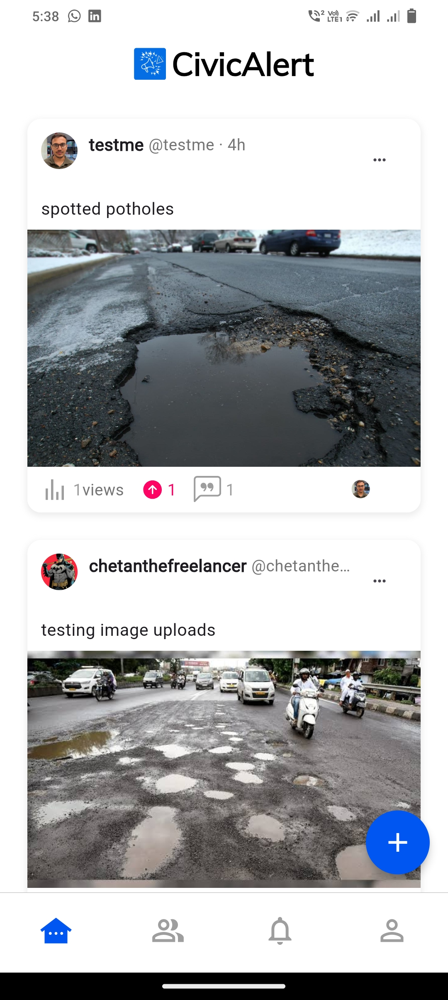
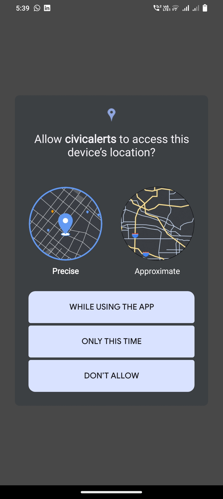
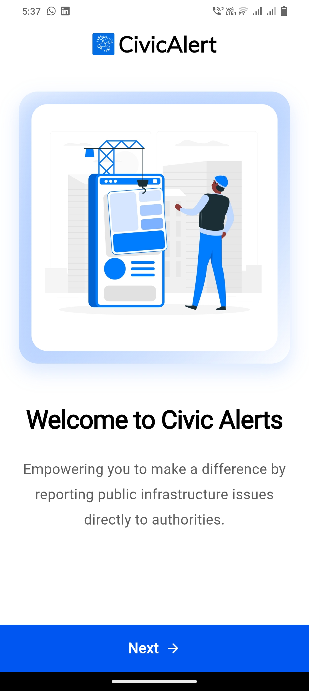
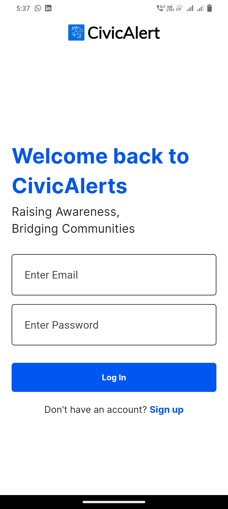
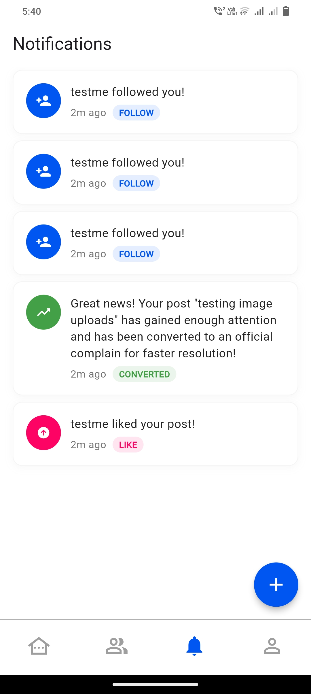
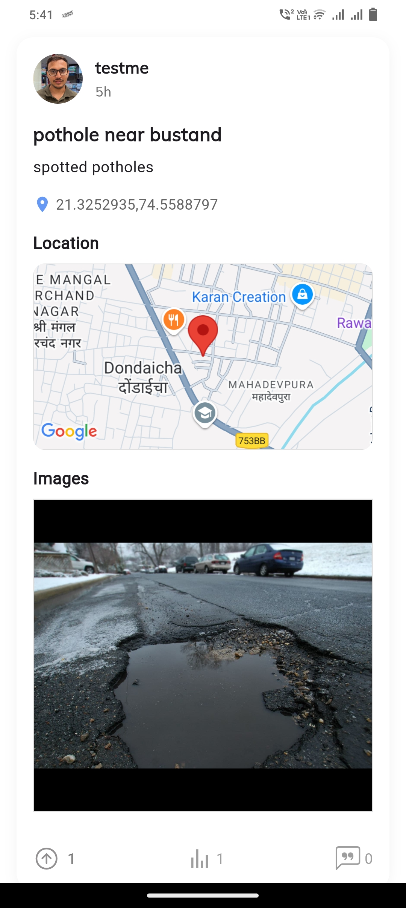
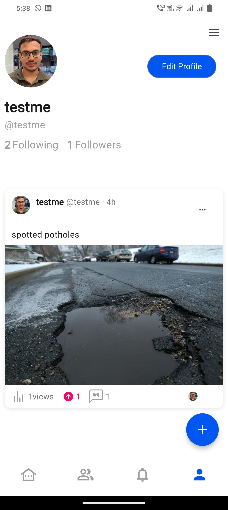
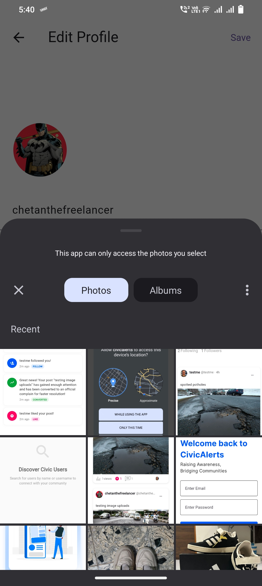
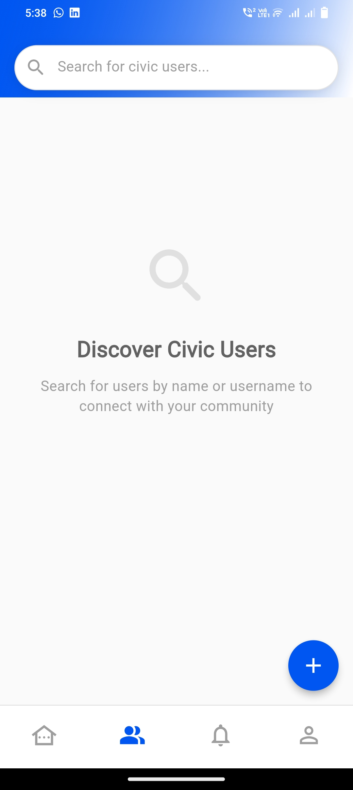

# CivicAlerts – Road Issue Reporting App

CivicAlerts is a cross-platform mobile application built to empower communities to report infrastructure issues efficiently. Users can submit issues with photos, descriptions, and precise GPS coordinates, utilizing a crowd-based voting system that automatically notifies authorities when a post reaches a 10% upvote threshold. The app enhances transparency and tracks complaint resolution, fostering better civic engagement.

## 🚀 Features

### Core Functionality
- **Welcome Screens**: Onboarding screens to guide new users through the app's functionality
- **Authentication**: Secure user login and registration using Appwrite
- **Post Creation**: Users can create posts with:
  - **Geotagging**: Accurate location capture using Google Maps, including longitude and latitude
  - **Image Picker**: Upload photos to document issues
  - **Descriptions**: Add detailed text to describe the reported issue

### Community Engagement
- **Crowd-Based Voting**: Posts receiving 10% upvote threshold are automatically converted into formal complaints and sent to authorities
- **Real-Time Notifications**: Instant updates for likes, follows, comments, and post-to-complaint conversions
- **Comments**: Users can comment on posts to discuss issues
- **Post Views**: Track the number of views for each post

### User Management
- **Search Users**: Find users by username
- **Edit Profile**: Update user details and profile picture
- **Admin Dashboard**: Built with HTML, CSS, JavaScript, and Node.js for managing reports and user activity

### UI/UX
- **Responsive UI**: Smooth and intuitive interface with carousel sliders and animations

## 🛠️ Tech Stack

### Mobile App
- **Flutter & Dart**: For cross-platform iOS and Android development
- **Appwrite**: Backend-as-a-Service for authentication, database, and real-time notifications
- **Google Maps Flutter**: For geotagging and location services
- **Image Picker**: For capturing and uploading images
- **Geolocator & Permission Handler**: For precise GPS location and permission management
- **Flutter Riverpod**: For state management
- **Other Libraries**: flutter_svg, carousel_slider, smooth_page_indicator, timeago, like_button, badges, logger, google_fonts, fpdart, loading_animation_widget, cupertino_icons

### Admin Dashboard
- **HTML, CSS, JavaScript**: For front-end interface
- **Node.js**: For backend logic and API integration

## 📦 Dependencies

Below is the dependency list from the `pubspec.yaml` file, required for the app to function:

```yaml
dependencies:
  flutter:
    sdk: flutter
  cupertino_icons: ^1.0.8
  appwrite: ^14.0.0
  flutter_svg: ^2.0.17
  loading_animation_widget: ^1.2.1
  google_fonts: ^6.2.1
  flutter_riverpod: ^2.1.3
  fpdart: ^0.4.0
  geolocator: ^13.0.2
  permission_handler: ^11.3.1
  google_maps_flutter: ^2.9.0
  image_picker: ^1.1.2
  carousel_slider: ^5.0.0
  smooth_page_indicator: ^1.2.1
  timeago: ^3.7.0
  like_button: ^2.0.5
  badges: ^3.1.2
  logger: ^2.5.0
```

To upgrade dependencies to the latest versions, run:
```bash
flutter pub upgrade --major-versions
```

To check for outdated dependencies, run:
```bash
flutter pub outdated
```

## 🚀 Installation

1. **Clone the repository:**
   ```bash
   git clone <repository-url>
   ```

2. **Navigate to the project directory:**
   ```bash
   cd CivicAlerts
   ```

3. **Install dependencies:**
   ```bash
   flutter pub get
   ```

4. **Configure Appwrite:**
   - Set up an Appwrite instance and update the endpoint and project ID in the app's configuration

5. **Run the app:**
   ```bash
   flutter run
   ```

## 📱 Usage

1. **Sign Up/Login**: Create an account or log in to access the app
2. **Report an Issue**: Use the post creation feature to upload a photo, add a description, and tag the location via Google Maps
3. **Vote & Comment**: Engage with posts by upvoting or commenting to support issues
4. **Track Complaints**: Once a post reaches the 10% upvote threshold, it becomes a complaint, and authorities are notified
5. **Admin Dashboard**: Admins can log in to the web-based dashboard to manage reports and monitor user activity

## 🤝 Contributing

Contributions are welcome! Please follow these steps:

1. Fork the repository
2. Create a new branch (`git checkout -b feature-branch`)
3. Make your changes and commit (`git commit -m 'Add new feature'`)
4. Push to the branch (`git push origin feature-branch`)
5. Create a pull request

## 📄 License

This project is licensed under the MIT License.

## 📞 Support

For any questions or support, please open an issue in the repository or contact the development team.

---

*Built with ❤️ for better civic engagement and community empowerment*


## Screenshots

<p align="center">
  
  
  
</p>

<p align="center">
  
  
  
</p>

<p align="center">
  
  
  
</p>
